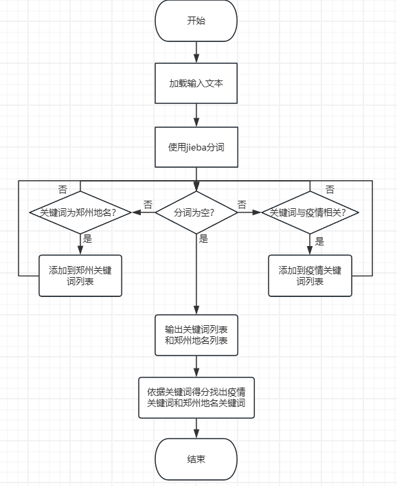

# 运行环境
    windows 10
    python 3.9
# 安装依赖
    MarkupSafe	2.1.5	
    blinker	1.8.2	
    certifi	2024.7.4	
    charset-normalizer	3.3.2	
    click	8.1.7	
    colorama	0.4.6	
    flask	3.0.3	
    idna	3.7	
    importlib-metadata	8.2.0	
    itsdangerous	2.2.0	
    jieba	0.42.1	
    jinja2	3.1.4	
    pip	23.2.1	
    requests	2.32.3	
    setuptools	68.2.0	
    urllib3	2.2.2	
    werkzeug	3.0.3	
    wheel	0.41.2	
    zipp	3.19.2	
参考requirements.txt  

## 任务一：
### 1. 任务要求  
写一个接口，利用jieba分词，提取输入内容的关键词和地名。要求能够识别到郑州疫情相关的关键词，屏蔽郑州市以外的地名。
### 2. 请求示例  
```
{
    "text": "今天早上我去郑大一附院，发现健康码变成了红码。"
}
```
### 3. 响应示例
```
{
    "keyword": "红码",
    "address": "郑大一附院"
}
```
## 代码说明
custom_dict.txt: 自定义词典  
epidemic_keywords.txt:疫情相关关键词词典  
jieba_keyword_extraction.py:功能实现脚本  
send_request.py:发送request请求脚本  
stopwords.txt:停用词词典  
~~test.py:测试用脚本~~  
web_test.py:创建本地服务脚本  
zhengzhou_locations.txt:郑州地名相关地址词典  

## 制定计划
截止时间：8月9日，周五  
8月7日：  
    完成计划，准备资源。  
8月8日：   
    执行计划，记录进展  
8月9日  
    撰写报告，反馈和优化，学习与总结。  
任务要求：  
• 学习jieba的常用方法   
◦ jieba分词模式，如何实现分词，分词的算法，自定义词典   
• 熟悉flask框架   
• 分词按照自定义词典文件 custom_dict.txt分词    
• 疫情相关关键词和郑州地名关键词分别创建词典.txt文件    
• 后续可以人为添加疫情相关关键词和郑州地名关键词    
• 要求找出的疫情相关关键词和郑州地名关键词的关键程度最高    
• 后续将数据从文本文件的读写改到数据库上存储   
• 考虑使用transformer的attention机制自动化分关键词，并找出最关键的词   
## 任务一具体实施想法：  
准备资源：  
    网页搜索关键词：jieba分词、文本处理、关键词提取。  
    B站搜索：  
    github搜索：  
第一步：先拷打GPT，形成可行的方案。  
第二步：自己编写代码。  
第三步：考虑接入数据库。  
###  伪代码：
```commandline
定义函数 read_keywords_from_file(文件名):  
    初始化一个空字典 keywords  
    打开文件并读取每一行  
        分割每一行为关键词和分数  
        将关键词和分数（转换为整数）添加到 keywords 字典中  
    返回 keywords 字典  
  
加载自定义词典到 jieba  
  
从 epidemic_keywords.txt 文件中读取疫情关键词及其分数  
从 zhengzhou_locations.txt 文件中读取郑州地名及其分数  
  
定义函数 extract_most_important_keyword_and_location(文本):  
    使用 jieba 对文本进行分词  
    初始化空字典 keyword_scores 和 location_scores  
    遍历分词结果中的每个词:  
        如果词在疫情关键词中:  
            在 keyword_scores 中增加该词的分数  
        如果词在郑州地名中:  
            在 location_scores 中增加该词的分数  
    从 keyword_scores 中找出分数最高的关键词作为最关键疫情关键词  
    从 location_scores 中找出分数最高的地名作为最关键地名  
    返回包含最关键疫情关键词和地名的字典  
  
定义示例文本列表 texts  
  
遍历 texts 中的每个文本:  
    调用 extract_most_important_keyword_and_location 函数并获取结果  
    打印示例编号、文本内容、最关键疫情关键词和最关键地名
```
实现流程图：

# TODO:接入数据库
